covid_recovery_analysis
================
Cary Ni
2023-03-23

## Introduction

This project aims to develop a prediction model for recovery time along
with the identification of potential risk factors associated with a long
recovery time from Covid-19. The data come from a combination of three
cohort studies that collect information through questionnaires and
medical records and tracked over several years.

## Exploratory analysis and data visualization

|                                                  |            |
|:-------------------------------------------------|:-----------|
| Name                                             | Piped data |
| Number of rows                                   | 2000       |
| Number of columns                                | 16         |
| \_\_\_\_\_\_\_\_\_\_\_\_\_\_\_\_\_\_\_\_\_\_\_   |            |
| Column type frequency:                           |            |
| factor                                           | 8          |
| numeric                                          | 8          |
| \_\_\_\_\_\_\_\_\_\_\_\_\_\_\_\_\_\_\_\_\_\_\_\_ |            |
| Group variables                                  | None       |

Data summary

**Variable type: factor**

| skim_variable | n_missing | complete_rate | ordered | n_unique | top_counts                     |
|:--------------|----------:|--------------:|:--------|---------:|:-------------------------------|
| gender        |         0 |             1 | FALSE   |        2 | 0: 1049, 1: 951                |
| race          |         0 |             1 | FALSE   |        4 | 1: 1304, 3: 406, 4: 197, 2: 93 |
| smoking       |         0 |             1 | FALSE   |        3 | 0: 1221, 1: 588, 2: 191        |
| hypertension  |         0 |             1 | FALSE   |        2 | 0: 1053, 1: 947                |
| diabetes      |         0 |             1 | FALSE   |        2 | 0: 1699, 1: 301                |
| vaccine       |         0 |             1 | FALSE   |        2 | 1: 1168, 0: 832                |
| severity      |         0 |             1 | FALSE   |        2 | 0: 1807, 1: 193                |
| study         |         0 |             1 | FALSE   |        3 | B: 1229, A: 390, C: 381        |

**Variable type: numeric**

| skim_variable | n_missing | complete_rate |    mean |      sd |    p0 |     p25 |    p50 |    p75 |   p100 | hist  |
|:--------------|----------:|--------------:|--------:|--------:|------:|--------:|-------:|-------:|-------:|:------|
| id            |         0 |             1 | 4995.42 | 2832.70 |   2.0 | 2603.25 | 4966.5 | 7424.5 | 9999.0 | ▇▇▇▇▇ |
| age           |         0 |             1 |   60.16 |    4.47 |  45.0 |   57.00 |   60.0 |   63.0 |   79.0 | ▁▅▇▂▁ |
| height        |         0 |             1 |  170.00 |    6.00 | 148.1 |  166.00 |  170.0 |  173.9 |  188.6 | ▁▂▇▅▁ |
| weight        |         0 |             1 |   79.96 |    7.20 |  57.1 |   75.10 |   79.9 |   84.8 |  104.2 | ▁▅▇▃▁ |
| bmi           |         0 |             1 |   27.73 |    2.82 |  19.6 |   25.80 |   27.6 |   29.5 |   38.4 | ▁▇▇▂▁ |
| SBP           |         0 |             1 |  129.92 |    7.95 | 103.0 |  125.00 |  130.0 |  135.0 |  156.0 | ▁▃▇▅▁ |
| LDL           |         0 |             1 |  110.19 |   19.80 |  32.0 |   97.00 |  110.0 |  124.0 |  172.0 | ▁▂▇▆▁ |
| recovery_time |         0 |             1 |   43.50 |   31.09 |   3.0 |   28.00 |   39.0 |   51.0 |  365.0 | ▇▁▁▁▁ |

### Visualize potential relationship between reponse variable and numeric predictors

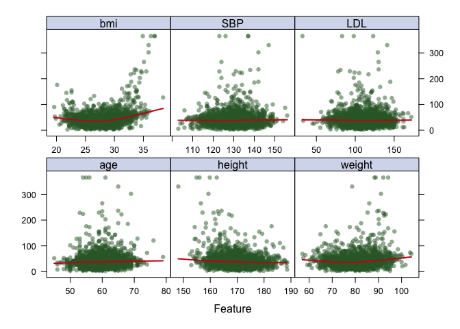<!-- -->

### Visualize potential relationship between reponse variable and categorical predictors

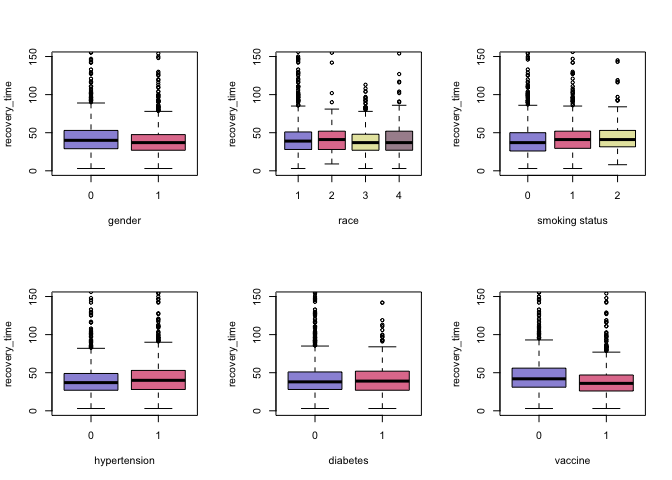<!-- -->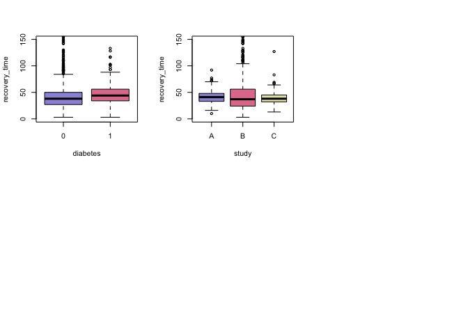<!-- -->

### Correlation plot to check collinearity between covariates (based on training data)

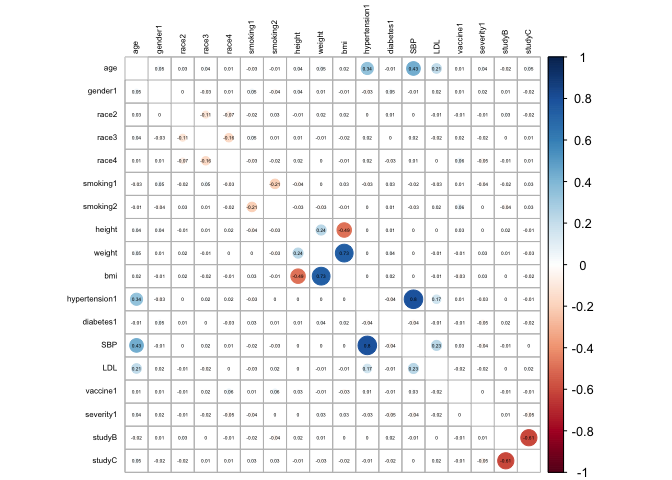<!-- -->

It can be seen from the scatterplots below that `SBP`, `LDL`, and `age`
are the continuous variables linearly correlated (small correlation
coefficient though) to `recovery_time` while no apparent discrepancy is
found when finding the association between `recovery_time` and the
categorical variables of different levels. The correlation plot suggests
that `SBP` is positively correlated to `hypertension` while the
correlation among `bmi`, `weight`, and `height` are foreseen. In short,
there is no obvious collinearity among most of the covariates (none of
them exceed the threshold of 0.8).

## Model Training

### Ordinary Least square

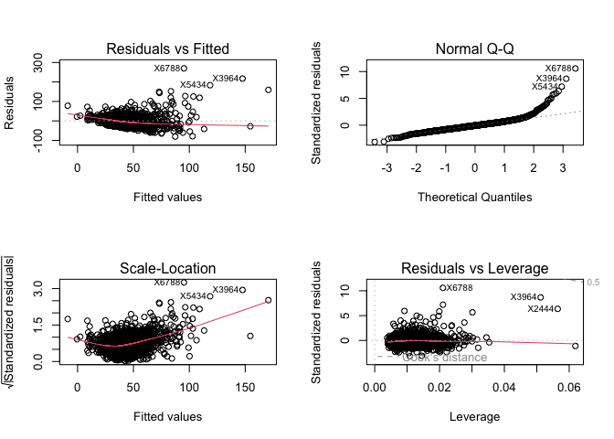<!-- -->

While ordinary linear regression assumes linear relationship, normality
of residuals, homoscedasticity, and independence of residual error
terms, it can be seen from the diagnostic plots that the assumptions of
normally distributed residuals and homoscedasticity are violated.
Therefore, regularization methods and nonlinear methods should be
introduced.

### Elastic net regression

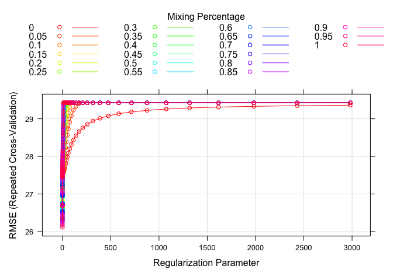<!-- -->

    ##      alpha    lambda
    ## 1001     1 0.1353353

### Partial least squares

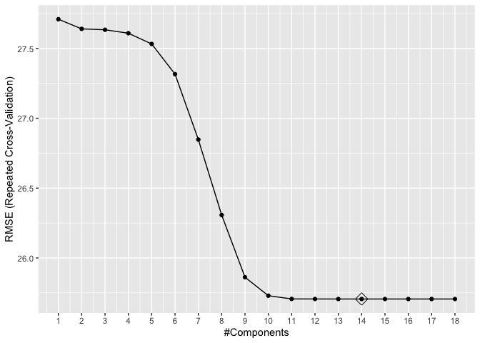<!-- -->

Since the assumptions of OLS are not met, parameter
regularization/dimension reduction methods of the elastic net and
partial least squares are used for model building. Through the process
of cross validation, the resulting elastic net model gives an alpha at
1, which is equivalent to the Lasso model with penalty coefficient of
0.135. The PLS model gives 14 components after cross-validation for best
predictability.

### Generalized Additive Models (GAM)

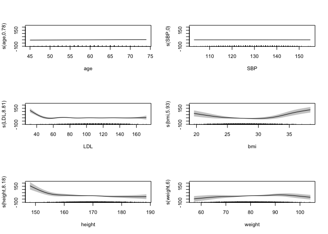<!-- -->

For generalized additive model, the selected model after
cross-validation has no penalty to each term, 6 out of 18 predictors get
smooth terms while the rest of predictors are linearly related to the
response variable.

### Multivariate adaptive regression spline model (MARS)

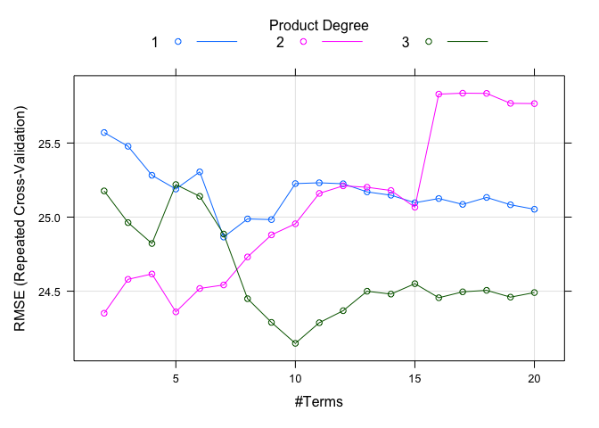<!-- -->

    ##    nprune degree
    ## 47     10      3

In the selected multivariate adaptive regression spline model after
cross-validation, there is 10 terms with degree of 3. Within the 7
predictors in the model, bmi is of most significance as it is included
in 9 out of 10 terms.

### K-Nearest Neighbors (KNN)

    ##    k
    ## 6 12

The selected KNN model has the tuning parameter k = 12 after
cross-validation.

### Generalized Boosted Regression

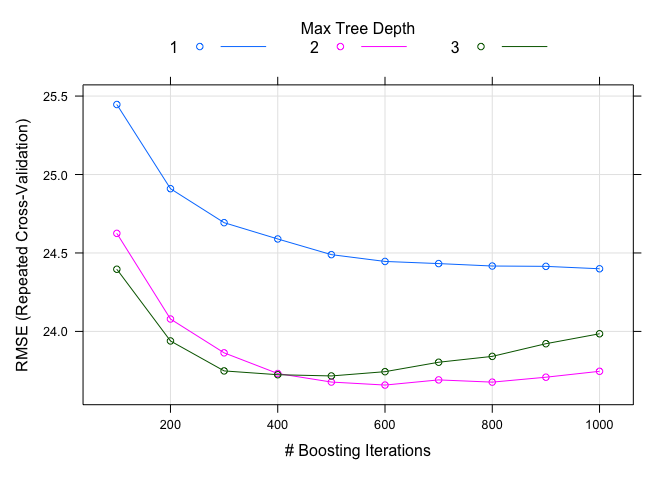<!-- -->

The resulting generalized boosted regression model has 600 trees with 2
splits performed on a tree when the learning rate is specified as 0.02
based on size of training set and each terminal node has at least 10
observations.

### Models comparsion based on cross validation error

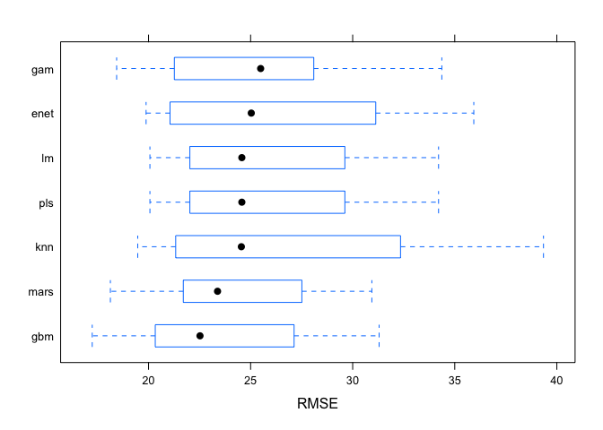<!-- -->

## Results

### Test Mean Squared Error

    ## [1] 748.4655

### Variable importance plots

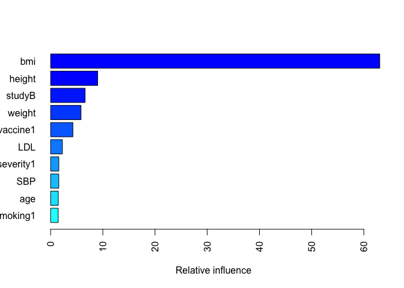<!-- -->

|               |    rel.inf |
|:--------------|-----------:|
| bmi           | 63.0493226 |
| height        |  9.0091073 |
| studyB        |  6.6109336 |
| weight        |  5.8246237 |
| vaccine1      |  4.2622552 |
| LDL           |  2.2613620 |
| severity1     |  1.5747687 |
| SBP           |  1.5669913 |
| age           |  1.4736886 |
| smoking1      |  1.4541593 |
| gender1       |  1.4338109 |
| smoking2      |  0.6074393 |
| hypertension1 |  0.5483854 |
| race2         |  0.2682331 |
| diabetes1     |  0.0341425 |
| race4         |  0.0207763 |
| race3         |  0.0000000 |
| studyC        |  0.0000000 |

### Partial dependance plots

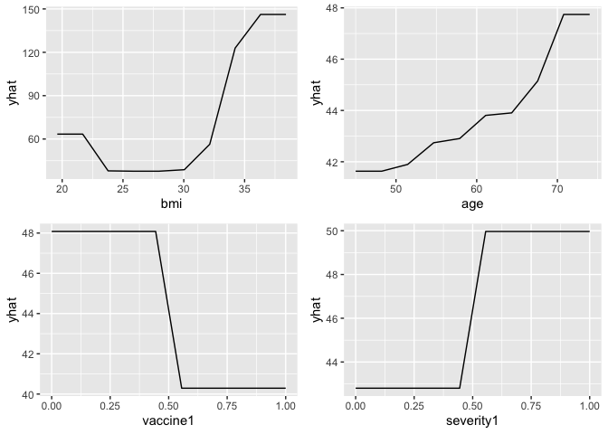<!-- -->

The generalized boosted regression model is selected as the final model
for its best training performance with the lowest cross-validation root
mean square error (23.66) among all models. This boosted regression
model has a test mean squared error of 748.5. As shown by the final
model, `BMI` is believed to be the most important predictor, which
accounts for more than 63% of the reduction to the loss function given
this set of predictors. `Height` and `Weight` are second and third most
important predictors because of their mathematical relationship to BMI.
A partial dependence plot shows that the recovery time is relatively
short for individuals with a BMI between 23 and 30, whereas the obese
patients with BMI greater than 30 tend to experience a remarkably long
recovery period from Covid-19. `Vaccine`, another factor that draw the
public attention, does help to slightly shorten the recovery time as
shown by the partial dependence plot while the recovery time increases
mildly as `Age` increases for the elderly over 50. On the other hand,
the variables such as systolic blood pressure (`SBP`), `Race`, and
`Diabetes` have little influence on the recovery time from Covid-19.

## Conclusion

Based on the generalized boosted regression model with the best
performance in predictions, BMI is the single most important factor that
influences long recovery time (as well as weight and height due to their
mathematical relationship to BMI). Obese patients with a BMI over 32
will experience a remarkably longer recovery period compared to patients
with a lower BMI. Other common risk factors, such as symptom severity
and age, do have a positive correlation with the length of recovery
time, while vaccination does shorten the recovery period. However, there
is no evidence to suggest that the aforementioned factors have an effect
on the scenario of long recovery time as they only associate with a mild
difference in recovery time.
